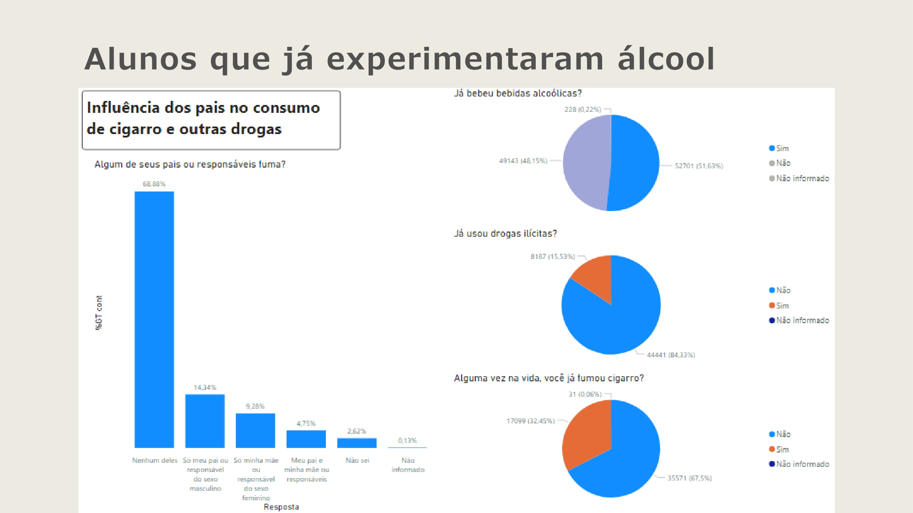

# AnaliseDadosIBGE
Este trabalho visa analisar dados do IBGE para correlacionar variáveis sociais estatísticas.

O enunciado pede para escolher algumas questões da base de dado, modelar os dados e ter insights de análises.

Abaixo está a apresentação das análises convertida para o formato de imagens:

